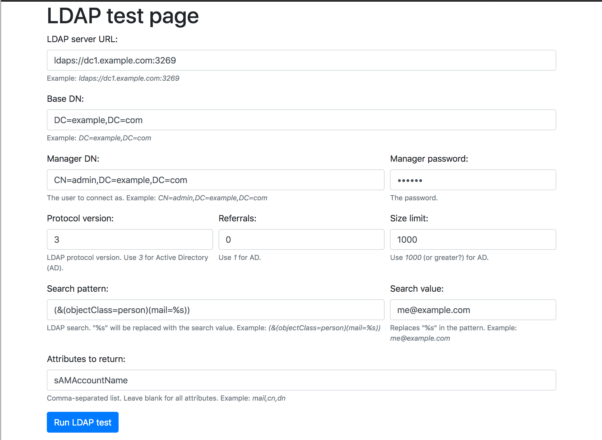
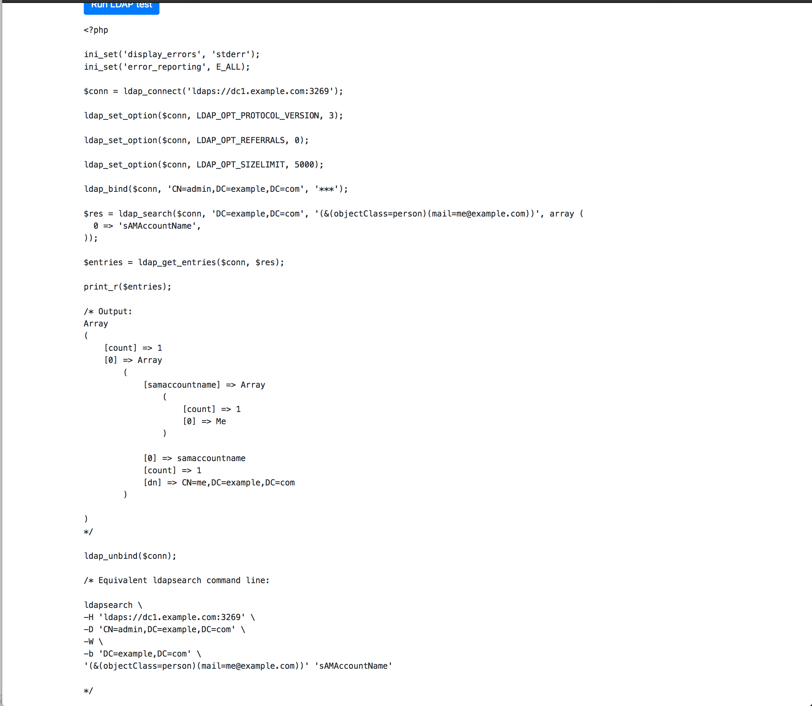

# ldap-test-page
A simple page to test LDAP connection and search, in a single PHP file

*Use at your own risk. Do not use in a production environment!*

First, clone this repository on your local computer or a server.

If you don’t want to have to enter all parameters in the Web page, copy and configure the config file example:

```
$ cp app/config.example.php app/config.php
$ vi app/config.php
``` 

Then start it using Docker:

```
$ docker-compose up -d
```

Now you can access the LDAP test page on http://localhost:8080/.

On that page, you fill in LDAP connection and search parameters:



The page will show the PHP code for the LDAP search, results, and an equivalent `ldapsearch` command line:


